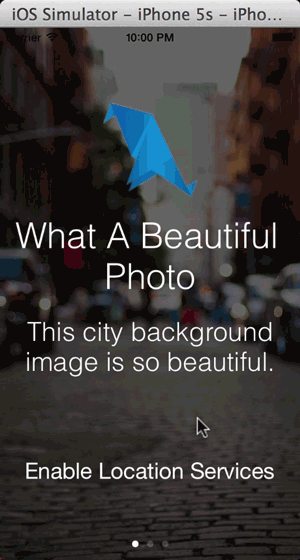
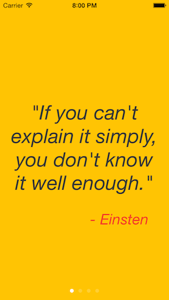
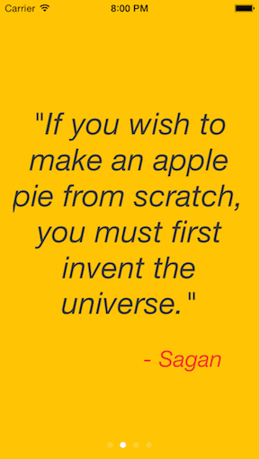
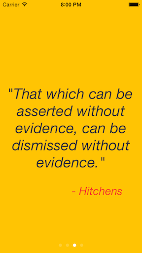

Onboard
==================

Onboard provides developers with a quick and easy means to create a beautiful, engaging, and useful onboarding experience with only a few lines of code.


Usage
=====

Drop the OnboardingViewController and OnboardingContentViewController header and implementation files into your project, import them into your AppDelegate, and you're ready to create an awesome onboarding experience for your users!

Create individual pages by creating an OnboardingContentViewController, providing it a title, body, image, text for an action button, and within the action block handle whatever you want to do when the users press the button. If you don't want a button, you can leave both the button text and action handler nil.

```js
OnboardingContentViewController *firstPage = [[OnboardingContentViewController alloc] initWithTitle:@"Page Title" body:@"Page body goes here." image:[UIImage imageNamed:@"icon"] buttonText:@"Text For Button" action:^{
    // do something here when users press the button, like ask for location services permissions, register for push notifications, connect to social media, or finish the onboarding process
}];

```

Then create the OnboardingViewController by providing a background image and an array of OnboardingContentViewControllers you just created. You can then present the view modally and get the onboarding process started!

```js
OnboardingViewController *onboardingVC = [[OnboardingViewController alloc] initWithBackgroundImage:[UIImage imageNamed:@"background"] contents:@[firstPage, secondPage, thirdPage]];

```

With only a few lines of code you have a beautiful, end-to-end onboarding process that will get your users excited to use your awesome application.





Customization
=============

The content pages can be customized by setting the provided padding, font, and size properties on either the pages individually (if you want something different on each) or on the OnboardingViewController itself, which will pass those properties to all of the content view controllers.

```js
OnboardingViewController *onboardingVC = [[OnboardingViewController alloc] initWithBackgroundImage:yourImage contents:yourContentsArray];
onboardingVC.fontName = @"Helvetica-Light";
onboardingVC.titleFontSize = 28;
onboardingVC.bodyFontSize = 22;
onboardingVC.topPadding = 20;
onboardingVC.underIconPadding = 10;
onboardingVC.underTitlePadding = 15;
onboardingVC.bottomPadding = 20;

```


Blurring and Masking
=============

By default, the image you use for the background will have a mask applied over it, darkening it a bit. This is to add a little bit of contrast so the text can more easily be seen. This can easily be disabled if your image is already edited or looks fine as-is:

```js
onboardingVC.shouldMaskBackground = NO; // defaults to YES
```

We can also apply a blur to your background image:

```js
onboardingVC.shouldBlurBackground = YES; // defaults to NO
```

You can tweak these settings in a few different combinations to get your desired effect:


Samples
=============







Notes
=====

I'm not currently supporting landscape at the moment, so I would recommend either using this in an application that only supports portrait, or wrapping it in a subclassed UINavigationController that only supports portrait.


Community
=====

Questions, comments, issues, and pull requests welcomed!!


License
=====

This project is made available under the MIT license. See LICENSE.txt for details.
