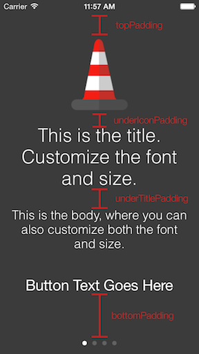
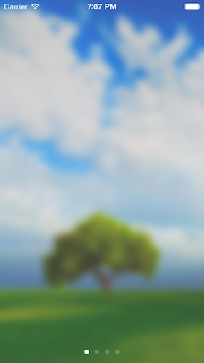

# Onboard


[](https://cocoapods.org/pods/Onboard)
[](https://travis-ci.org/mamaral/Onboard)
[](https://github.com/Carthage/Carthage)
[](http://doge.mit-license.org)


# [Click Here For More Examples](examples.md)

Important
=========

Onboard is no longer under active development, and as such if you create any issues or submit pull requests, it's not very likely to be integrated. Thanks to all that helped make Onboard better over the last few years!

Usage
=====

Adding the following to your `Podfile` and running `pod install` should do the trick:

```
pod 'Onboard'
```

*If you don't want to use CocoaPods*, you can use Carthage or grab the files located in the *Source* folder and pull them into your project manually.

Each onboarding experience is comprised of two primary components - the background and the content pages. The background includes the static background image/video, the page control, and the skip button. The content pages are made up of four pieces, an image/icon, title, body, and action button.

Create individual pages by creating instances of `OnboardingContentViewController`. Provide a title, body, image, text for an action button, and within the action block handle whatever you want to do when the users press the button. If you don't want a button, you can leave both the button text and action handler nil.

#### Objective-C
```objective-c
OnboardingContentViewController *firstPage = [OnboardingContentViewController contentWithTitle:@"Page Title" body:@"Page body goes here." image:[UIImage imageNamed:@"icon"] buttonText:@"Text For Button" action:^{
    // do something here when users press the button, like ask for location services permissions, register for push notifications, connect to social media, or finish the onboarding process
}];
```
#### Swift
```Swift
let firstPage = OnboardingContentViewController(title: "Page Title", body: "Page body goes here.", image: UIImage(named: "icon"), buttonText: "Text For Button") { () -> Void in
    // do something here when users press the button, like ask for location services permissions, register for push notifications, connect to social media, or finish the onboarding process
    }
```

Then create the `OnboardingViewController` by providing either a background image or a URL to a local video file in your project, and an array of content view controllers you just created. You can then present the view modally and get the onboarding process started!

#### Objective-C
```objective-c
// Image
OnboardingViewController *onboardingVC = [OnboardingViewController onboardWithBackgroundImage:[UIImage imageNamed:@"background"] contents:@[firstPage, secondPage, thirdPage]];

// Video
NSBundle *bundle = [NSBundle mainBundle];
NSString *moviePath = [bundle pathForResource:@"yourVid" ofType:@"mp4"];
NSURL *movieURL = [NSURL fileURLWithPath:moviePath];

OnboardingViewController *onboardingVC = [OnboardingViewController onboardWithBackgroundVideoURL:movieURL contents:@[firstPage, secondPage, thirdPage]];
```
#### Swift
```swift
// Image
let onboardingVC = OnboardingViewController(backgroundImage: UIImage(named: "background"), contents: [firstPage, secondPage, thirdPage])

// Video
let bundle = NSBundle.mainBundle()
let moviePath = bundle.pathForResource("yourVid", ofType: "mp4")
let movieURL = NSURL(fileURLWithPath: moviePath!)

let onboardingVC = OnboardingViewController(backgroundVideoURL: movieUrl, contents: [firstPage, secondPage, thirdPage])
```


With only a few lines of code you have a beautiful, end-to-end onboarding process that will get your users excited to use your awesome application.


Customization
=============

The `iconImageView`, `titleLabel`, `bodyLabel`, and `actionButton` properties are exposed for customizing fonts, sizing, etc., and the spacing between elements on the content pages can be customized as well:

```objective-c
onboardingVC.topPadding = 20;
onboardingVC.underIconPadding = 10;
onboardingVC.underTitlePadding = 15;
onboardingVC.bottomPadding = 20;

```



Blurring, Masking, and Fading
=============

By default, the image you use for the background will have a mask applied over it, darkening it a bit. This is to add a little bit of contrast so the text can more easily be seen. This can easily be disabled if your image is already edited or looks fine as-is:

```objective-c
onboardingVC.shouldMaskBackground = NO; // defaults to YES
```

We can also apply a blur to your background image:

```objective-c
onboardingVC.shouldBlurBackground = YES; // defaults to NO
```

Apply a fade effect to the icons, text, and buttons, while transitioning between pages. Contents fade out as you scroll away, and the contents for the next page fade in as they scroll in.

```objective-c
onboardingVC.shouldFadeTransitions = YES; // defaults to NO
```

***Note:*** Ensure you do not cause the onboard view controller's view to be loaded prior to setting these properties, as these values only take effect when the view controller's `viewDidLoad` is called, so doing something like setting your `onboardingVC.view.backgroundColor = [UIColor whiteColor];` before setting this values would lead to the setting of these to not take effect.

You can tweak these settings in a few different combinations to get your desired effect:





Auto-Navigation
=============

If you want to automatically move users to the next page in the onboarding process when they press the action button simply set the `movesToNextViewController` property to `YES` on any `OnboardingContentViewController` that isn’t the last view controller in the onboarding process. Coupled with this, you can disable the ability to swipe between contents by setting the `swipingEnabled` property on the `OnboardingViewController` to `NO`. This allows you to have greater control over the onboarding process if you desire. Finally, if your design lends itself to not having a page control, or if it is only one page, you can set the `hidePageControl` property to `YES` and the page control dots will not appear.

```objective-c
contentVC.movesToNextViewController = YES;
onboardingVC.swipingEnabled = NO;
onboardingVC.hidePageControl = YES;
```

Skipping
=============

If you want to allow users to skip the onboarding process, enable skipping on the onboarding view controller and set a block to be executed when the skip button is pressed.

```objective-c
onboardingVC.allowSkipping = YES;
onboardingVC.skipHandler = ^{
    // Dismiss, fade out, etc...
};
```

Blocks
=========

There may be cases in which you want to do *something* when the content pages are about to appear, and when they did appear. In this case, you can set the viewWillAppearBlock and viewDidAppearBlock properties on any or all of the content pages to handle whatever you’d like.

```objective-c
contentVC.viewWillAppearBlock = ^{
	// do something when the view will appear here…
}

contentVC.viewDidAppearBlock = ^{
	// do something when the view appears here…
}
```


Notes
=====

I'm not currently supporting landscape at the moment, so I would recommend either using this in an application that only supports portrait, or wrapping it in a subclassed UINavigationController that only supports portrait.


Community
=====

Questions, comments, issues, and pull requests welcomed!!


License
=====

This project is made available under the MIT license. See LICENSE.txt for details.
