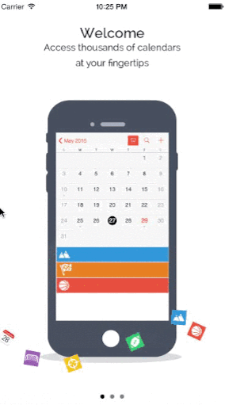
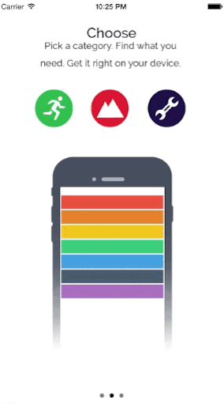
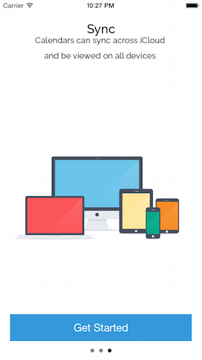

Here are some examples I've put together for fun, as well as apps submitted by others who are using Onboard
===

If your app is currently using onboard, let me know and I would love to feature it here!

[Gemr](http://www.gemr.com/ "Gemr")
===

[Tripnary](http://tripnary.com/ "Tripnary")
===

[Almanac - coming soon!](https://github.com/rldaulton)
===

More Samples
=============

